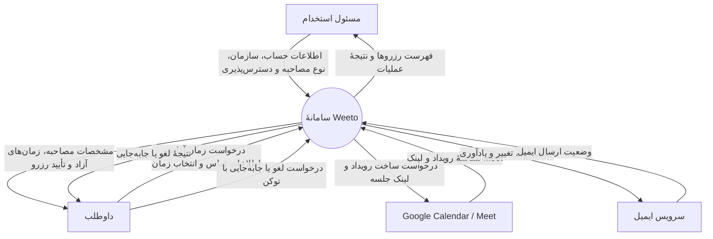

```mermaid
flowchart TB
    R["مسئول استخدام"]
    C["داوطلب"]
    G["Google Calendar / Meet"]
    E["سرویس ایمیل"]
    W(("سامانهٔ Weeto"))

    R -->|"اطلاعات حساب، سازمان، نوع مصاحبه و دسترس‌پذیری"| W
    W -->|"فهرست رزروها و نتیجهٔ عملیات"| R
    C -->|"درخواست زمان آزاد، اطلاعات تماس و انتخاب زمان"| W
    W -->|"مشخصات مصاحبه، زمان‌های آزاد و تأیید رزرو"| C
    C -->|"درخواست لغو یا جابه‌جایی با توکن"| W
    W -->|"نتیجهٔ لغو یا جابه‌جایی"| C
    W -->|"درخواست ساخت رویداد و لینک جلسه"| G
    G -->|"شناسهٔ رویداد و لینک Meet"| W
    W -->|"ایمیل تأیید، تغییر و یادآوری"| E
    E -->|"وضعیت ارسال ایمیل"| W
```
