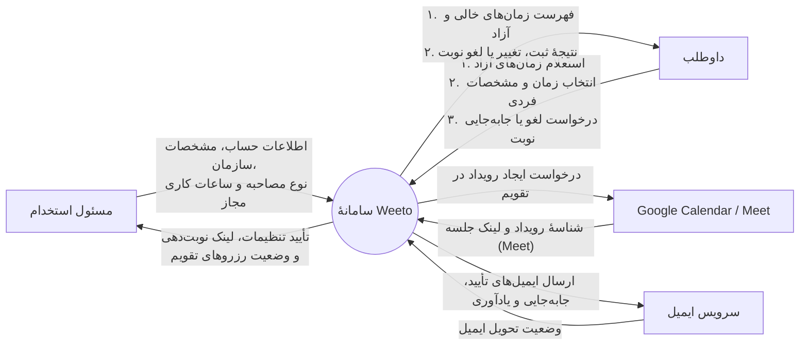

```mermaid
flowchart LR
    R["مسئول استخدام"]
    C["داوطلب"]
    W(("سامانهٔ Weeto"))
    G["Google Calendar / Meet"]
    E["سرویس ایمیل"]

    R -->|"اطلاعات حساب، مشخصات سازمان،<br/>نوع مصاحبه و ساعات کاری مجاز"| W
    W -->|"تأیید تنظیمات، لینک نوبت‌دهی<br/>و وضعیت رزروهای تقویم"| R

    C -->|"۱. استعلام زمان‌های آزاد<br/>۲. انتخاب زمان و مشخصات فردی<br/>۳. درخواست لغو یا جابه‌جایی نوبت"| W
    W -->|"۱. فهرست زمان‌های خالی و آزاد<br/>۲. نتیجهٔ ثبت، تغییر یا لغو نوبت"| C

    W -->|"درخواست ایجاد رویداد در تقویم"| G
    G -->|"شناسهٔ رویداد و لینک جلسه (Meet)"| W

    W -->|"ارسال ایمیل‌های تأیید، جابه‌جایی و یادآوری"| E
    E -->|"وضعیت تحویل ایمیل"| W
```
