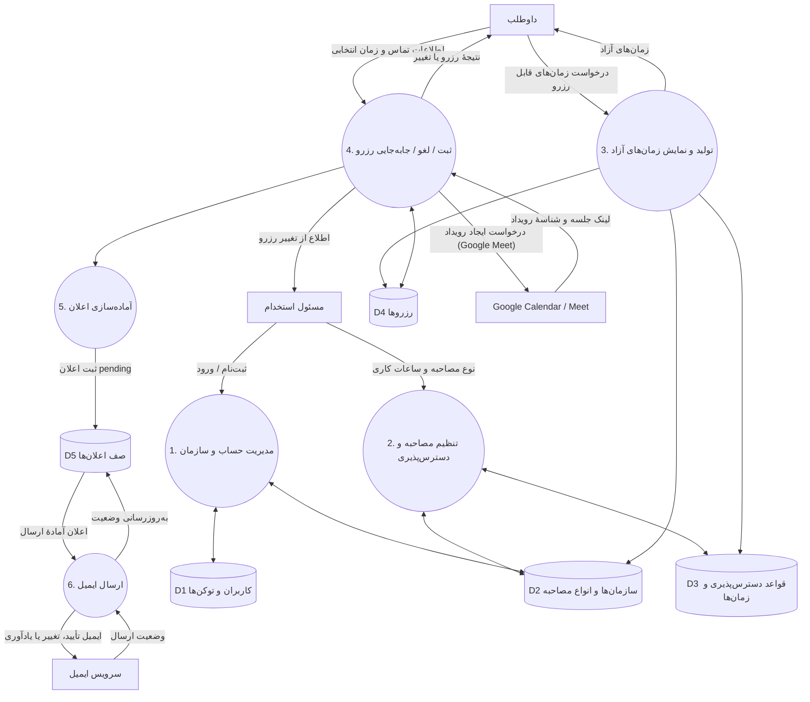

```mermaid
flowchart TB
    R["مسئول استخدام"]
    C["داوطلب"]

    P1(("1. مدیریت حساب و سازمان"))
    P2(("2. تنظیم مصاحبه و دسترس‌پذیری"))
    P3(("3. تولید و نمایش زمان‌های آزاد"))
    P4(("4. ثبت / لغو / جابه‌جایی رزرو"))
    P5(("5. آماده‌سازی اعلان"))
    P6(("6. ارسال ایمیل"))

    D1[("D1 کاربران و توکن‌ها")]
    D2[("D2 سازمان‌ها و انواع مصاحبه")]
    D3[("D3 قواعد دسترس‌پذیری و زمان‌ها")]
    D4[("D4 رزروها")]
    D5[("D5 صف اعلان‌ها")]

    G["Google Calendar / Meet"]
    E["سرویس ایمیل"]

    R -->|"ثبت‌نام / ورود"| P1
    P1 <--> D1
    P1 <--> D2

    R -->|"نوع مصاحبه و ساعات کاری"| P2
    P2 <--> D2
    P2 <--> D3

    C -->|"درخواست زمان‌های قابل رزرو"| P3
    P3 --> D2
    P3 --> D3
    P3 --> D4
    P3 -->|"زمان‌های آزاد"| C

    C -->|"اطلاعات تماس و زمان انتخابی"| P4
    P4 <--> D4
    P4 -->|"درخواست ایجاد رویداد (Google Meet)"| G
    G -->|"لینک جلسه و شناسهٔ رویداد"| P4
    P4 -->|"نتیجهٔ رزرو یا تغییر"| C
    P4 -->|"اطلاع از تغییر رزرو"| R
    P4 --> P5

    P5 -->|"ثبت اعلان pending"| D5
    D5 -->|"اعلان آمادهٔ ارسال"| P6
    P6 -->|"ایمیل تأیید، تغییر یا یادآوری"| E
    E -->|"وضعیت ارسال"| P6
    P6 -->|"به‌روزرسانی وضعیت"| D5
```
