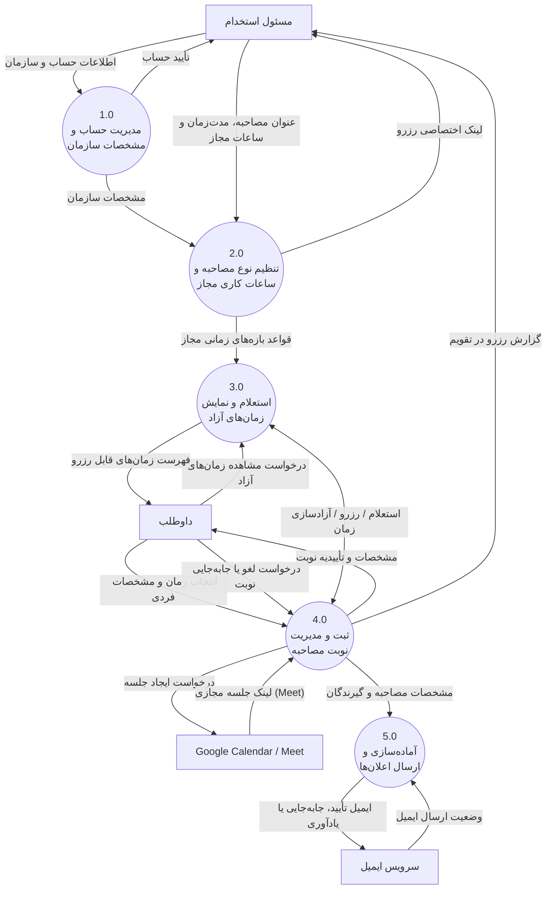

```mermaid
flowchart TB
    R["مسئول استخدام"]
    C["داوطلب"]
    G["Google Calendar / Meet"]
    E["سرویس ایمیل"]

    P1(("1.0<br/>مدیریت حساب و<br/>مشخصات سازمان"))
    P2(("2.0<br/>تنظیم نوع مصاحبه و<br/>ساعات کاری مجاز"))
    P3(("3.0<br/>استعلام و نمایش<br/>زمان‌های آزاد"))
    P4(("4.0<br/>ثبت و مدیریت<br/>نوبت مصاحبه"))
    P5(("5.0<br/>آماده‌سازی و<br/>ارسال اعلان‌ها"))

    R -->|"اطلاعات حساب و سازمان"| P1
    P1 -->|"تأیید حساب"| R
    P1 -->|"مشخصات سازمان"| P2

    R -->|"عنوان مصاحبه، مدت‌زمان و ساعات مجاز"| P2
    P2 -->|"لینک اختصاصی رزرو"| R
    P2 -->|"قواعد بازه‌های زمانی مجاز"| P3

    C -->|"درخواست مشاهده زمان‌های آزاد"| P3
    P3 -->|"فهرست زمان‌های قابل رزرو"| C

    C -->|"انتخاب زمان و مشخصات فردی"| P4
    C -->|"درخواست لغو یا جابه‌جایی نوبت"| P4
    
    P4 <-->|"استعلام / رزرو / آزادسازی زمان"| P3
    
    P4 -->|"درخواست ایجاد جلسه"| G
    G -->|"لینک جلسه مجازی (Meet)"| P4
    
    P4 -->|"مشخصات و تأییدیه نوبت"| C
    P4 -->|"گزارش رزرو در تقویم"| R

    P4 -->|"مشخصات مصاحبه و گیرندگان"| P5
    P5 -->|"ایمیل تأیید، جابه‌جایی یا یادآوری"| E
    E -->|"وضعیت ارسال ایمیل"| P5
```
