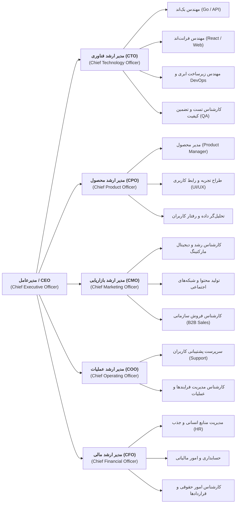

```mermaid
flowchart LR
    CEO["<b>مدیرعامل / CEO</b><br/>(Chief Executive Officer)"]

    %% مدیران ارشد (C-Suite)
    CEO --> CTO["<b>مدیر ارشد فناوری (CTO)</b><br/>(Chief Technology Officer)"]
    CEO --> CPO["<b>مدیر ارشد محصول (CPO)</b><br/>(Chief Product Officer)"]
    CEO --> CMO["<b>مدیر ارشد بازاریابی (CMO)</b><br/>(Chief Marketing Officer)"]
    CEO --> COO["<b>مدیر ارشد عملیات (COO)</b><br/>(Chief Operating Officer)"]
    CEO --> CFO["<b>مدیر ارشد مالی (CFO)</b><br/>(Chief Financial Officer)"]

    %% تیم فناوری و مهندسی (CTO)
    CTO --> BE["مهندس بک‌اند (Go / API)"]
    CTO --> FE["مهندس فرانت‌اند (React / Web)"]
    CTO --> DO["مهندس زیرساخت ابری و DevOps"]
    CTO --> QA["کارشناس تست و تضمین کیفیت (QA)"]

    %% تیم محصول و طراحی (CPO)
    CPO --> PM["مدیر محصول (Product Manager)"]
    CPO --> UIUX["طراح تجربه و رابط کاربری (UI/UX)"]
    CPO --> DATA["تحلیل‌گر داده و رفتار کاربران"]

    %% تیم بازاریابی و فروش (CMO)
    CMO --> GROWTH["کارشناس رشد و دیجیتال مارکتینگ"]
    CMO --> CONTENT["تولید محتوا و شبکه‌های اجتماعی"]
    CMO --> B2B["کارشناس فروش سازمانی (B2B Sales)"]

    %% تیم عملیات و مشتریان (COO)
    COO --> CS["سرپرست پشتیبانی کاربران (Support)"]
    COO --> OPS_LEAD["کارشناس مدیریت فرایندها و عملیات"]

    %% تیم مالی و اداری (CFO)
    CFO --> HR["مدیریت منابع انسانی و جذب (HR)"]
    CFO --> ACC["حسابداری و امور مالیاتی"]
    CFO --> LEGAL["کارشناس امور حقوقی و قراردادها"]
```
